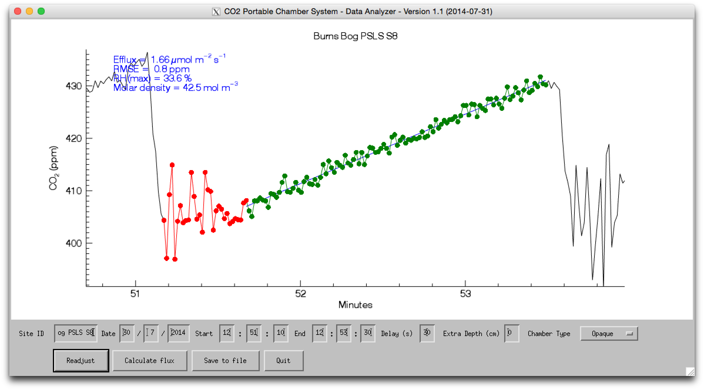

UBC-Portable-CO2-Chamber
========================

Software to interactively graph data measured by the portable carbon-dioxide chamber system developed in the University of British Columbia (UBC) biometerology group and to  calculate and tabulate carbon-dioxide soil fluxes.

Description of the system
========================

The UBC portable chamber system is a non-steady state portable chamber to measure soil fluxes of carbon dioxide (CO2), developed and tested in  research projects at the University of British Columbia (Jassal et al. 2005, 2007). 

The measurement head has a volume of 1.4 x 10-3 m3 (height: 15.6 cm, diameter: 10.7 cm), measuring flux from a surface area of 79 cm2 (the inner diameter of the collar). Both opaque (PVC) and transparent (acrylic) chambers can be used, depending whether soil respiration (opaque), or net ecosystem exchange (NEE, i.e. respiration minus photosynthesis) (transparent) is of interest.

In operation, the chamber is placed on a collar for 2 minutes. A foam gasket provides a seal between the collar and the chamber. A pump (flow rate of 600 cm3 min-1) circulates air from the chamber into a portable, battery operated infrared gas analyzer (IRGA) (LI-800, LI-COR Inc., Lincoln, NE, USA) and back into the chamber through a closed circuit. The IRGA measures CO2 and water vapour concentrations at 1-second intervals during the run. The data from the IRGA were digitized using a 21X data logger (Campbell Scientific Inc. (CSI), Logan, UT, USA) and stored on a memory module to  calculate the rate of change in the CO2 mixing ratios (d[CO2]/dt) in the chamber over the period of the measurement (see Section 2.3). Simultaneously, a thermocouple was used to measure soil temperature at the ~5-cm depth just outside the collar.

The software here allows to calculate fluxes in an interactive way from those datasets. 

The following components are required:

Description of the software
========================

co2_chamber_ascii_def.sav
------------------------

This is a IDL ASCII file description, created using the procedure ASCII_TEMPLATE. It is specifically attributing the fields in the data logger files to variabales.

co2_chamber.pro
------------------------

This is the uncompiled source code of the user-interface in Interactive Data Language (V. 8.1). It contants subroutines to manage date handling and calculate vapour pressure. The main routine is "co2_chamber"

co2_chamber.sav
------------------------

This is a compiled version of the code, to be run without license in Interactive Data Language using the free IDL virtual machine (runtime version), which is available <a  href="http://www.exelisvis.com/Support/HelpArticles/TabId/185/ArtMID/800/ArticleID/12395/The-IDL-Virtual-Machine.aspx"> here </a>

manual.pdf
------------------------

Is a user manual that describes the functionality of the software on page 7 ff.

manual.doc
------------------------

Is a word file of the user manual (same as manual.pdf)

References
------------------------
Jassal RS, Black TA, Cai T, Morgenstern K, Li Z, Gaumont-Guay D, Nesic Z (2007) 'Components of ecosystem respiration and estimates of net primary productivity of an intermediate-aged Douglas-fir stand'. Agricultural and Forest Meteorology, 144: 44-57.

Jassal RS, Black TA, Novak MD, Morgenstern K, Nesic Z, Gaumont-Guay D (2005) 'Relationship between soil CO2 concentrations and forest-floor CO2 effluxes'. Agricultural and Forest Meteorology, 130: 176-192.
